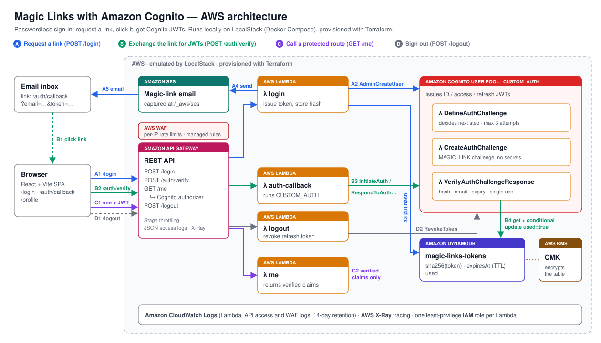
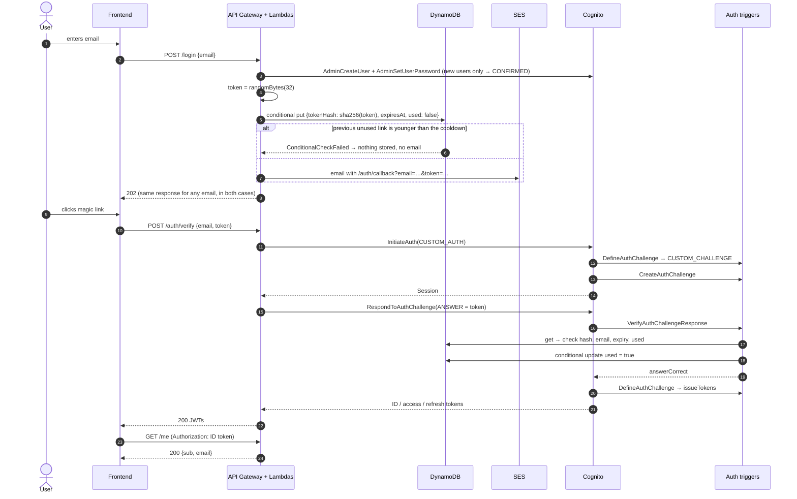

# Magic Links with Amazon Cognito

Passwordless authentication with **magic links** on **Amazon Cognito custom authentication**. The whole stack runs **100% locally** on LocalStack and is provisioned with Terraform.

Enter your email, click the link you receive, and you get Cognito JWTs. No passwords, and no AWS account needed.

> Based on Yan Cui's article [Implementing Magic Links with Amazon Cognito: A Step-by-Step Guide](https://theburningmonk.com/2023/03/implementing-magic-links-with-amazon-cognito-a-step-by-step-guide/), re-architected around DynamoDB and hashed single-use tokens (see [How this differs from the article](#how-this-differs-from-the-article)).


---

## Features

**Security**

- ✅ Passwordless authentication
- ✅ Cryptographically secure tokens (256-bit, `crypto.randomBytes`)
- ✅ SHA-256 token hashing: no plaintext tokens are stored
- ✅ Token expiration (10 minutes, plus DynamoDB TTL cleanup)
- ✅ Single-use tokens, enforced by an atomic conditional write
- ✅ Token invalidation: a new link revokes the previous one
- ✅ Email ownership verification: the token is bound to the Cognito user's email
- ✅ Constant-time hash comparison
- ✅ No user enumeration: `/login` gives the same response for every email
- ✅ Encryption at rest with a customer-managed KMS key
- ✅ Least-privilege IAM, one role per Lambda
- ✅ Per-email cooldown (one link per minute) and API Gateway stage throttling against email bombing

**Engineering**

- ✅ Cognito `CUSTOM_AUTH` with Define / Create / Verify triggers
- ✅ Infrastructure as Code (Terraform)
- ✅ Local AWS emulation (LocalStack + Docker Compose)
- ✅ Unit tests with 100% coverage (backend + frontend), integration tests, a Postman API collection and Playwright browser E2E tests
- ✅ Observability: explicit CloudWatch log groups with retention, JSON access logs, X-Ray tracing
- ✅ Lint + format with Biome, Terraform static analysis with tflint and Checkov
- ✅ CI on GitHub Actions: audit, lint, typecheck, tests, build, Terraform checks, LocalStack E2E
- ✅ React + Vite frontend

---

## Architecture



- **A. Request a link.** `POST /login` makes sure a Cognito user exists, stores `sha256(token)` in DynamoDB and emails the link with SES.
- **B. Exchange the link.** The frontend posts `{email, token}` to `/auth/verify`. The Lambda runs Cognito `CUSTOM_AUTH`, and the `VerifyAuthChallengeResponse` trigger consumes the token atomically.
- **C. Use the JWT.** `GET /me` is protected by the API Gateway Cognito authorizer, so the Lambda only ever sees verified claims.

More diagrams (Mermaid sources in [`docs/mmd`](docs/mmd), rendered to [`docs/img`](docs/img)):

| Diagram | What it shows |
|---|---|
| [Components](docs/img/architecture.svg) | Lambdas, Cognito triggers and the AWS services they use |
| [Sequence](docs/img/magic-link-sequence.svg) | The full request → email → JWT → `/me` flow |
| [DefineAuthChallenge](docs/img/define-auth-challenge.svg) | The custom-auth state machine (retries, failure, token issue) |
| [Token rules](docs/img/verify-token-rules.svg) | Every check the verify trigger makes, in order |
| [Deployment](docs/img/deployment.svg) | Docker Compose, LocalStack, Terraform and the test runners |

### The flow



---

## How this differs from the article

The article stores the magic-link token in a Cognito **custom attribute**. As the author points out, that caps throughput at the `AdminUpdateUserAttributes` rate limit. It also makes the link carry KMS-encrypted state.

This project keeps the same Cognito trigger mechanics and changes where the state lives:

| | Article | This project |
|---|---|---|
| Token storage | Cognito custom attribute | DynamoDB, keyed by `EMAIL#<email>` |
| What is stored | Token (KMS-encrypted payload) | **SHA-256 hash only** |
| Throughput | Bounded by Cognito admin API limits | DynamoDB on-demand |
| Single use | Attribute overwritten after login | Atomic `ConditionExpression` (race-safe) |
| Cleanup | Manual | DynamoDB TTL on `expiresAt` |
| Cognito `Session` problem | Session must outlive the email | Auth starts **when the link is opened**, so no long-lived session |
| KMS | Encrypts the token payload | Customer-managed key for the table |

**Why SHA-256 and not bcrypt?** Password hashes are slow on purpose, because passwords have little entropy. These tokens are 256 bits from a CSPRNG, so brute-forcing a SHA-256 preimage is already infeasible. A fast hash is the right tool here.

---

## Tech stack

| Layer | Technology |
|---|---|
| Language | TypeScript (strict), Node.js 22 |
| Auth | Amazon Cognito User Pools, custom auth triggers |
| Compute | AWS Lambda (bundled with esbuild) |
| API | Amazon API Gateway (REST) with a Cognito authorizer |
| Data | Amazon DynamoDB (TTL, conditional writes) |
| Email | Amazon SES |
| Encryption | AWS KMS (customer-managed key) |
| IaC | Terraform |
| Local cloud | LocalStack in Docker Compose |
| Validation | Zod |
| Tests | Vitest, aws-sdk-client-mock, Postman/newman |
| Lint / format | Biome |
| Observability | CloudWatch Logs, X-Ray |
| Frontend | React 19 + Vite |
| CI | GitHub Actions |

---

## Project structure

```
.
├── apps/
│   ├── api/src/
│   │   ├── handlers/
│   │   │   ├── login.ts                 # POST /login
│   │   │   ├── auth-callback.ts         # POST /auth/verify → JWTs
│   │   │   └── me.ts                    # GET /me (Cognito authorizer)
│   │   ├── services/
│   │   │   ├── token.service.ts         # generate / hash / compare tokens
│   │   │   ├── magic-link.service.ts    # issue + consume links (core rules)
│   │   │   ├── email.service.ts         # SES email + templates
│   │   │   └── cognito.service.ts       # AdminCreateUser + CUSTOM_AUTH
│   │   ├── repositories/
│   │   │   └── magic-link.repository.ts # DynamoDB access
│   │   └── lib/                         # env, http, validation, logging, AWS clients
│   ├── cognito/triggers/
│   │   ├── define-auth-challenge.ts
│   │   ├── create-auth-challenge.ts
│   │   └── verify-auth-challenge.ts
│   └── frontend/                        # React + Vite
├── infrastructure/terraform/            # Cognito, Lambda, API GW, DynamoDB, SES, KMS, IAM, logs
├── api/                                 # Postman collection (API contract tests)
├── arch/architecture.svg                # high-level AWS architecture
├── docs/{mmd,img}/                      # Mermaid sources and rendered diagrams
├── tests/
│   ├── unit/
│   └── integration/                     # runs against LocalStack
├── scripts/
│   ├── build.mjs                        # esbuild → dist/<function>/index.js
│   ├── emails.mjs                       # read emails captured by LocalStack SES
│   └── demo.sh                          # full flow with curl
├── biome.json                           # lint + format
├── docker-compose.yml
└── Makefile
```

---

## Getting started

### Prerequisites

- Docker
- Node.js 22+
- Terraform 1.6+
- `jq` (for the `make login` / `make verify` / `make demo` helpers)
- Optional: [tflint](https://github.com/terraform-linters/tflint) and [Checkov](https://www.checkov.io) for `make tf-scan`
- **A LocalStack auth token on a plan that includes Cognito.** Since LocalStack 2026.03 every image needs a token to start, and Cognito User Pools are not part of the free **Hobby** plan ([plan comparison](https://docs.localstack.cloud/aws/licensing/)). Get a token at [app.localstack.cloud](https://app.localstack.cloud/workspace/auth-token). Without one you can still run lint, typecheck, unit tests, builds and the Terraform checks.

### 1. Install and configure

```bash
npm install
cp .env.example .env    # then set LOCALSTACK_AUTH_TOKEN
```

### 2. Start LocalStack

```bash
make up
```

### 3. Deploy the infrastructure

```bash
make infra
```

This bundles the Lambdas with esbuild, runs `terraform apply` against LocalStack, and writes the API URL to `apps/frontend/.env.local`.

```
✓ KMS key            ✓ DynamoDB table (TTL + CMK encryption)
✓ SES identity       ✓ IAM roles (one per Lambda)
✓ 6 Lambdas          ✓ Cognito user pool + client + triggers
✓ API Gateway        ✓ Cognito authorizer + throttling
✓ CloudWatch log groups (14-day retention) + JSON access logs
```

### 4. Try it

**From the terminal:**

```bash
make demo EMAIL=luiz@example.com
```

```
▶ 1. POST /login  (luiz@example.com)
▶ 2. Magic link captured by LocalStack SES
▶ 3. POST /auth/verify  (Cognito CUSTOM_AUTH)
▶ 4. GET /me  (JWT validated by the API Gateway Cognito authorizer)
▶ 5. Reusing the same link must fail
HTTP 401
```

**Step by step:**

```bash
make login  EMAIL=luiz@example.com   # request a link
make emails                          # read the captured email
make verify EMAIL=luiz@example.com   # exchange the latest link for JWTs
```

**In the browser:**

```bash
make frontend        # http://localhost:5173
```

Enter an email, run `make link EMAIL=<that email>`, and open the printed URL.

### Cleaning up

```bash
make down            # stops LocalStack and deletes its data + Terraform state
```

Run `make help` to see every target.

### Environment variables

**`.env`** (read by Docker Compose, copy from [`.env.example`](.env.example)):

| Variable | Required | Description |
|---|---|---|
| `LOCALSTACK_AUTH_TOKEN` | yes | LocalStack license token (Cognito needs it) |
| `LOCALSTACK_IMAGE` | no | Override the pinned LocalStack image |
| `LOCALSTACK_DEBUG` | no | `1` for verbose LocalStack logs |

**Lambdas** (set by Terraform in [`lambda.tf`](infrastructure/terraform/lambda.tf), never by hand):

| Variable | Used by | Description |
|---|---|---|
| `USER_POOL_ID`, `USER_POOL_CLIENT_ID` | login, auth-callback | Cognito pool and public client |
| `MAGIC_LINKS_TABLE` | login, verify trigger | DynamoDB table name |
| `SES_FROM_ADDRESS` | login | Sender address |
| `MAGIC_LINK_CALLBACK_URL` | login | Frontend route the link points to |
| `MAGIC_LINK_TTL_SECONDS` | login | Link lifetime (default `600`) |
| `MAGIC_LINK_COOLDOWN_SECONDS` | login | Minimum time between two links for one email (default `60`) |
| `CORS_ALLOWED_ORIGIN` | API Lambdas | Allowed origin |

Missing required variables fail the request with a `500` and a clear log line, instead of reaching AWS with `undefined`. There are no secrets: tokens are generated per request and only their hash is stored.

**Frontend:** `make infra` writes `VITE_API_PROXY_TARGET` (the API Gateway URL) to `apps/frontend/.env.local`; the Vite dev server proxies `/api` to it.

**Terraform variables** ([`variables.tf`](infrastructure/terraform/variables.tf)) cover names, URLs, the link TTL and cooldown (`magic_link_cooldown_seconds`, default 60), log retention (`log_retention_days`, default 14) and API throttling (`api_throttle_rate_limit` / `api_throttle_burst_limit`, default 10 rps / 20 burst).

---

## API

| Method | Path | Auth | Description |
|---|---|---|---|
| `POST` | `/login` | none | Sends a magic link. Always returns `202`. |
| `POST` | `/auth/verify` | none | Exchanges `{email, token}` for Cognito JWTs. |
| `GET` | `/me` | Cognito ID token | Returns the verified claims. |

```bash
API=$(terraform -chdir=infrastructure/terraform output -raw api_url)

curl -X POST "$API/login" -H 'Content-Type: application/json' \
  -d '{"email":"luiz@example.com"}'
# 202 {"message":"If the email address is valid, a magic link is on its way."}

curl -X POST "$API/auth/verify" -H 'Content-Type: application/json' \
  -d '{"email":"luiz@example.com","token":"<64 hex chars>"}'
# 200 {"idToken":"eyJ…","accessToken":"eyJ…","refreshToken":"…","expiresIn":3600,"tokenType":"Bearer"}
# 401 {"message":"Invalid or expired magic link"}

curl "$API/me" -H "Authorization: <idToken>"
# 200 {"sub":"…","email":"luiz@example.com","authTime":"…","expiresAt":"…"}
```

**Postman collection.** [`api/magic-links.postman_collection.json`](api/magic-links.postman_collection.json) covers every endpoint: `202` responses, `400` validation errors, `401` for wrong, reused or missing tokens, and the full happy path (it reads the magic link from LocalStack's SES mailbox). Import it into Postman and set `apiUrl` to `terraform output -raw api_url`, or run it headless with `npm run test:api`.

### Data model

A single DynamoDB item per email. Writing a new link replaces the old one.

| Attribute | Example | Notes |
|---|---|---|
| `pk` | `EMAIL#luiz@example.com` | Partition key |
| `email` | `luiz@example.com` | Normalized (trimmed, lower-case) |
| `tokenHash` | `9f86d0…` | `SHA256(token)`, hex |
| `createdAt` | `1767268800` | Epoch seconds |
| `expiresAt` | `1767269400` | Epoch seconds; also the TTL attribute |
| `used` | `false` | Flipped atomically on first use |
| `usedAt` | `1767268900` | Set on consumption |

---

## Testing

| Command | What it runs | Needs |
|---|---|---|
| `npm run lint` | Biome lint + format check | — |
| `npm run typecheck` | `tsc --noEmit` for backend and frontend | — |
| `npm test` / `npm run test:coverage` | Unit tests, backend + frontend (coverage must stay at 100%) | — |
| `npm run build` | esbuild bundles in `dist/` | — |
| `npm run build -w apps/frontend` | Frontend production build | — |
| `npm run test:integration` | Integration tests against the deployed stack | `make up && make infra` |
| `npm run test:api` | Postman collection via newman | `make up && make infra` |
| `npm run test:e2e` | Browser E2E tests with Playwright (starts Vite itself) | `make up && make infra`, `npx playwright install chromium` |
| `make demo` | Terminal smoke test of the whole flow | `make up && make infra` |
| `make check` | lint + typecheck + unit tests + `terraform fmt -check` / `validate` | Terraform |
| `make tf-scan` | tflint + Checkov | tflint, Checkov |

Every layer covers both the happy path and the failure cases:

| Layer | Happy path | Sad path |
|---|---|---|
| **Unit** (Vitest, 116 tests, 100% statements/branches/functions/lines) | token primitives, link issue/consume, Cognito flow, triggers, handlers, React pages, router, session | expiry boundary, reuse, races, cooldown, wrong email, malformed input, AWS failures → 500 without leaking internals, incomplete Cognito responses, late responses after unmount |
| **Integration** (Vitest against LocalStack, 24 tests) | login → email → JWT → `/me`, user created `CONFIRMED`, only the hash stored, case-insensitive email, returning user | reuse, 5 parallel clicks → exactly one 200, wrong token doesn't burn the real one, cross-account token, unknown email, expiry, rotation, email bombing → one email, no enumeration, 400s, `/me` without/forged/access token, unknown routes |
| **API collection** (Postman, 20 requests / 38 assertions) | 202, 200 with JWTs, `/me` 200 | 400 (invalid JSON, missing/invalid/long email, `null`, array, bad token), 401 (wrong token, unknown email, reuse, no/forged/access token), 403 (wrong method), cooldown |
| **E2E** (Playwright, 7 tests) | sign in from the UI, profile, sign out, token gone from URL and history, `no-referrer` | link opened twice, tampered token, incomplete link, invalid email blocked by the browser |

**Unit tests** need no Docker. AWS calls are mocked with `aws-sdk-client-mock`; the React components run in `happy-dom` with Testing Library.

When no stack is deployed, the integration suite is skipped, so `npm run test:integration` never fails spuriously. In CI it runs only when a `LOCALSTACK_AUTH_TOKEN` repository secret is configured.

`npm run test:api` downloads a pinned newman with `npx` instead of adding it as a dependency, because newman's dependency tree has open advisories.

---

## CI

[`.github/workflows/ci.yml`](.github/workflows/ci.yml) runs on every push to `main` and every pull request:

| Job | Steps |
|---|---|
| **quality** | `npm ci` → `npm audit --audit-level=high` → lint → typecheck → unit tests with coverage → Lambda build → frontend build |
| **terraform** | `fmt -check` → `init -backend=false` → `validate` → tflint → Checkov (skips are justified in [`.checkov.yaml`](infrastructure/terraform/.checkov.yaml)) |
| **integration** | Docker Compose LocalStack → `make infra` (Terraform apply) → integration tests → Postman collection → Playwright browser E2E → `make demo` |

The integration job needs a `LOCALSTACK_AUTH_TOKEN` repository secret. Without it (for example on forks) the job is skipped rather than failed, since there is nothing to run against. There is no `terraform plan`/`apply` against a real AWS account because the project only targets LocalStack.

---

## Security considerations

**What is protected**

- **Leaked database.** Only SHA-256 hashes are stored, and they can't be reversed into working links. The table is also encrypted with a KMS CMK.
- **Replay.** `used` is flipped with a `ConditionExpression` that re-checks the hash, `used = false` and `expiresAt > now` in the same write. If two requests race, only one can win.
- **Stale links.** A new request overwrites the item, so older links stop working immediately.
- **Cross-account use.** The verify trigger reads the email from **Cognito's user attributes**, not from the client, so a token only works for the account it was issued to.
- **Timing attacks.** Hashes are compared with `crypto.timingSafeEqual`.
- **Enumeration.** `/login` answers `202` with the same body for every valid email, and the Cognito client has `prevent_user_existence_errors` enabled.
- **Log hygiene.** Tokens and JWTs are never logged, and emails are masked (`l***@example.com`).
- **URL leakage.** The callback page removes the token from the address bar and history before calling the API, whatever the outcome, and `<meta name="referrer" content="no-referrer">` keeps it out of `Referer` headers.
- **Email bombing.** A second link for the same email within 60 seconds is neither stored nor sent (atomic conditional write, so parallel requests can't bypass it). The response is the same `202`, so the cooldown reveals nothing.
- **First sign-in on real Cognito.** `AdminCreateUser` leaves users in `FORCE_CHANGE_PASSWORD`, and Cognito refuses to sign them in. `/login` sets a random permanent password nobody knows (the client only allows `CUSTOM_AUTH`), so new users are `CONFIRMED`. LocalStack does not enforce this rule, so an integration test checks the status directly.

**Known limitations / next steps**

- **Rate limiting.** The stage is throttled (10 rps, burst 20) and each email has a cooldown, but there is no per-IP limit: someone can still send one email per minute to many different addresses. In production, add AWS WAF rate-based rules. LocalStack does not enforce stage throttling or concurrency limits: a burst of ~40 parallel requests spawns one Lambda container each and can stall LocalStack, so there is no automated `429` test.
- **Sign-out is local.** Signing out clears the browser session but does not revoke the refresh token (valid 30 days). A production app should call Cognito `RevokeToken` / `GlobalSignOut` from a backend.
- **Cognito throttling surfaces as `500`.** `TooManyRequestsException` from Cognito is not mapped to `429 Retry-After`.
- **Partial user creation.** If `AdminSetUserPassword` fails right after `AdminCreateUser`, the user stays in `FORCE_CHANGE_PASSWORD` and later requests skip creation. It is unlikely (two consecutive calls), and an admin can fix it with `admin-set-user-password --permanent`.
- **Implicit sign-up.** Any email that requests a link gets a Cognito user. Put a separate sign-up flow or an allow-list in front of this if that's not acceptable.
- **Token storage in the browser.** The demo keeps JWTs in `sessionStorage`. A production app should hold them in memory or in `httpOnly` cookies set by a backend-for-frontend.
- **Link scanners.** Some corporate email scanners prefetch links. The callback page exchanges the token with a `POST` from JavaScript, so scanners that only issue a `GET` don't consume the link. Scanners that run JavaScript still could; an explicit "Sign in" button on the callback page would close that gap.
- **Same-device only.** A link can't be opened on one device to sign in on another. Cross-device sign-in would need a polling or WebSocket handshake.

---

## Terraform

```bash
make infra                                            # build + init + apply against LocalStack
terraform -chdir=infrastructure/terraform plan        # preview changes (after make build)
make destroy                                          # destroy the resources
make outputs                                          # api_url, user_pool_id, …
```

**State.** State is local (`infrastructure/terraform/terraform.tfstate`, git-ignored) because the stack only lives inside a disposable LocalStack container; `make down` deletes both. No bootstrap is needed.

**Providers** are pinned in `main.tf` (`aws ~> 5.0`, `archive ~> 2.4`) and locked in `.terraform.lock.hcl`.

## Deploying to real AWS

The code has no LocalStack-specific logic. Inside LocalStack, the AWS SDK picks up `AWS_ENDPOINT_URL` automatically. To target a real account:

1. In [`main.tf`](infrastructure/terraform/main.tf), remove the static credentials, the `skip_*` flags and the `endpoints` block.
2. Bootstrap remote state once: an S3 bucket with versioning and encryption, then add a `backend "s3"` block with `use_lockfile = true` (Terraform ≥ 1.10), or a DynamoDB lock table for older versions.
3. Verify a real SES identity, and move SES out of the sandbox.
4. Point `magic_link_callback_url` / `frontend_origin` at your deployed frontend.
5. Revisit the production items skipped in [`.checkov.yaml`](infrastructure/terraform/.checkov.yaml): CloudWatch alarms with a notification target, WAF, longer log retention, Lambda aliases for gradual rollout.

---

## Architectural decisions

- **DynamoDB instead of a Cognito custom attribute** for token state. See [How this differs from the article](#how-this-differs-from-the-article).
- **One Lambda per route and per trigger.** Each has its own IAM role with only the permissions it needs; bundles are tiny because esbuild tree-shakes per entry point.
- **No Step Functions, queues or DLQs.** Every invocation is synchronous (API Gateway or Cognito), so there is no async work to orchestrate or retry.
- **Plain classes, no DI framework.** Handlers wire their dependencies directly. `MagicLinkService` holds the rules and `evaluateMagicLink` is a pure function, so the core logic is tested without AWS mocks.
- **Small in-house JSON logger** instead of Powertools: three functions with masked emails are all the logging these Lambdas need.
- **Biome** for lint and format. The project uses TypeScript 7 (native compiler), which `typescript-eslint` does not support yet.

---

## Credits

- [Yan Cui (theburningmonk)](https://theburningmonk.com/2023/03/implementing-magic-links-with-amazon-cognito-a-step-by-step-guide/), for the original article and the Cognito custom-auth approach.
- [LocalStack](https://localstack.cloud), for making it possible to run all of this on a laptop.

## License

[MIT](LICENSE)
