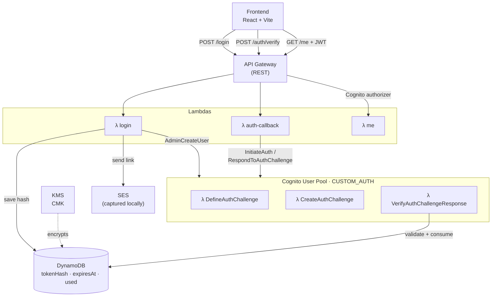
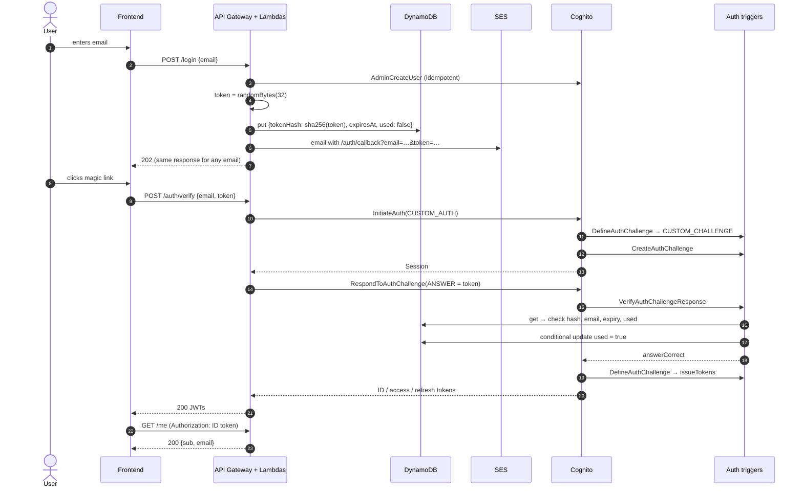

# Magic Links with Amazon Cognito

Passwordless authentication with **magic links** on **Amazon Cognito custom authentication**. The whole stack runs **100% locally** on LocalStack and is provisioned with Terraform.

Enter your email, click the link you receive, and you get Cognito JWTs. No passwords, and no AWS bill.

> Based on Yan Cui's article [Implementing Magic Links with Amazon Cognito: A Step-by-Step Guide](https://theburningmonk.com/2023/03/implementing-magic-links-with-amazon-cognito-a-step-by-step-guide/), re-architected around DynamoDB and hashed single-use tokens (see [How this differs from the article](#how-this-differs-from-the-article)).


---

## Features

**Security**

- ✅ Passwordless authentication
- ✅ Cryptographically secure tokens (256-bit, `crypto.randomBytes`)
- ✅ SHA-256 token hashing: no plaintext tokens are stored
- ✅ Token expiration (10 minutes, plus DynamoDB TTL cleanup)
- ✅ Single-use tokens, enforced by an atomic conditional write
- ✅ Token invalidation: a new link revokes the previous one
- ✅ Email ownership verification: the token is bound to the Cognito user's email
- ✅ Constant-time hash comparison
- ✅ No user enumeration: `/login` gives the same response for every email
- ✅ Encryption at rest with a customer-managed KMS key
- ✅ Least-privilege IAM, one role per Lambda

**Engineering**

- ✅ Cognito `CUSTOM_AUTH` with Define / Create / Verify triggers
- ✅ Infrastructure as Code (Terraform)
- ✅ Local AWS emulation (LocalStack + Docker Compose)
- ✅ Unit tests (Vitest + `aws-sdk-client-mock`) and end-to-end integration tests
- ✅ CI on GitHub Actions: typecheck, tests, build, `terraform validate`
- ✅ React + Vite frontend

---

## Architecture



### The flow



---

## How this differs from the article

The article stores the magic-link token in a Cognito **custom attribute**. As the author points out, that caps throughput at the `AdminUpdateUserAttributes` rate limit. It also makes the link carry KMS-encrypted state.

This project keeps the same Cognito trigger mechanics and changes where the state lives:

| | Article | This project |
|---|---|---|
| Token storage | Cognito custom attribute | DynamoDB, keyed by `EMAIL#<email>` |
| What is stored | Token (KMS-encrypted payload) | **SHA-256 hash only** |
| Throughput | Bounded by Cognito admin API limits | DynamoDB on-demand |
| Single use | Attribute overwritten after login | Atomic `ConditionExpression` (race-safe) |
| Cleanup | Manual | DynamoDB TTL on `expiresAt` |
| Cognito `Session` problem | Session must outlive the email | Auth starts **when the link is opened**, so no long-lived session |
| KMS | Encrypts the token payload | Customer-managed key for the table |

**Why SHA-256 and not bcrypt?** Password hashes are slow on purpose, because passwords have little entropy. These tokens are 256 bits from a CSPRNG, so brute-forcing a SHA-256 preimage is already infeasible. A fast hash is the right tool here.

---

## Tech stack

| Layer | Technology |
|---|---|
| Language | TypeScript (strict), Node.js 22 |
| Auth | Amazon Cognito User Pools, custom auth triggers |
| Compute | AWS Lambda (bundled with esbuild) |
| API | Amazon API Gateway (REST) with a Cognito authorizer |
| Data | Amazon DynamoDB (TTL, conditional writes) |
| Email | Amazon SES |
| Encryption | AWS KMS (customer-managed key) |
| IaC | Terraform |
| Local cloud | LocalStack in Docker Compose |
| Validation | Zod |
| Tests | Vitest, aws-sdk-client-mock |
| Frontend | React 19 + Vite |
| CI | GitHub Actions |

---

## Project structure

```
.
├── apps/
│   ├── api/src/
│   │   ├── handlers/
│   │   │   ├── login.ts                 # POST /login
│   │   │   ├── auth-callback.ts         # POST /auth/verify → JWTs
│   │   │   └── me.ts                    # GET /me (Cognito authorizer)
│   │   ├── services/
│   │   │   ├── token.service.ts         # generate / hash / compare tokens
│   │   │   ├── magic-link.service.ts    # issue + consume links (core rules)
│   │   │   ├── email.service.ts         # SES email + templates
│   │   │   └── cognito.service.ts       # AdminCreateUser + CUSTOM_AUTH
│   │   ├── repositories/
│   │   │   └── magic-link.repository.ts # DynamoDB access
│   │   └── lib/                         # env, http, validation, logging, AWS clients
│   ├── cognito/triggers/
│   │   ├── define-auth-challenge.ts
│   │   ├── create-auth-challenge.ts
│   │   └── verify-auth-challenge.ts
│   └── frontend/                        # React + Vite
├── infrastructure/terraform/            # Cognito, Lambda, API GW, DynamoDB, SES, KMS, IAM
├── tests/
│   ├── unit/
│   └── integration/                     # runs against LocalStack
├── scripts/
│   ├── build.mjs                        # esbuild → dist/<function>/index.js
│   ├── emails.mjs                       # read emails captured by LocalStack SES
│   └── demo.sh                          # full flow with curl
├── docker-compose.yml
└── Makefile
```

---

## Getting started

### Prerequisites

- Docker
- Node.js 22+
- Terraform 1.6+
- `jq` (for the `make login` / `make verify` / `make demo` helpers)
- **A LocalStack auth token.** The LocalStack image needs one to start, and Cognito is not in the free Community feature set. The free **Hobby** plan is enough. Get a token at [app.localstack.cloud](https://app.localstack.cloud/workspace/auth-token).

### 1. Install and configure

```bash
npm install
cp .env.example .env    # then set LOCALSTACK_AUTH_TOKEN
```

### 2. Start LocalStack

```bash
make up
```

### 3. Deploy the infrastructure

```bash
make infra
```

This bundles the Lambdas with esbuild, runs `terraform apply` against LocalStack, and writes the API URL to `apps/frontend/.env.local`.

```
✓ KMS key            ✓ DynamoDB table (TTL + CMK encryption)
✓ SES identity       ✓ IAM roles (one per Lambda)
✓ 6 Lambdas          ✓ Cognito user pool + client + triggers
✓ API Gateway        ✓ Cognito authorizer
```

### 4. Try it

**From the terminal:**

```bash
make demo EMAIL=luiz@example.com
```

```
▶ 1. POST /login  (luiz@example.com)
▶ 2. Magic link captured by LocalStack SES
▶ 3. POST /auth/verify  (Cognito CUSTOM_AUTH)
▶ 4. GET /me  (JWT validated by the API Gateway Cognito authorizer)
▶ 5. Reusing the same link must fail
HTTP 401
```

**Step by step:**

```bash
make login  EMAIL=luiz@example.com   # request a link
make emails                          # read the captured email
make verify EMAIL=luiz@example.com   # exchange the latest link for JWTs
```

**In the browser:**

```bash
make frontend        # http://localhost:5173
```

Enter an email, run `make link EMAIL=<that email>`, and open the printed URL.

### Cleaning up

```bash
make down            # stops LocalStack and deletes its data + Terraform state
```

Run `make help` to see every target.

---

## API

| Method | Path | Auth | Description |
|---|---|---|---|
| `POST` | `/login` | none | Sends a magic link. Always returns `202`. |
| `POST` | `/auth/verify` | none | Exchanges `{email, token}` for Cognito JWTs. |
| `GET` | `/me` | Cognito ID token | Returns the verified claims. |

```bash
API=$(terraform -chdir=infrastructure/terraform output -raw api_url)

curl -X POST "$API/login" -H 'Content-Type: application/json' \
  -d '{"email":"luiz@example.com"}'
# 202 {"message":"If the email address is valid, a magic link is on its way."}

curl -X POST "$API/auth/verify" -H 'Content-Type: application/json' \
  -d '{"email":"luiz@example.com","token":"<64 hex chars>"}'
# 200 {"idToken":"eyJ…","accessToken":"eyJ…","refreshToken":"…","expiresIn":3600,"tokenType":"Bearer"}
# 401 {"message":"Invalid or expired magic link"}

curl "$API/me" -H "Authorization: <idToken>"
# 200 {"sub":"…","email":"luiz@example.com","authTime":"…","expiresAt":"…"}
```

### Data model

A single DynamoDB item per email. Writing a new link replaces the old one.

| Attribute | Example | Notes |
|---|---|---|
| `pk` | `EMAIL#luiz@example.com` | Partition key |
| `email` | `luiz@example.com` | Normalized (trimmed, lower-case) |
| `tokenHash` | `9f86d0…` | `SHA256(token)`, hex |
| `createdAt` | `1767268800` | Epoch seconds |
| `expiresAt` | `1767269400` | Epoch seconds; also the TTL attribute |
| `used` | `false` | Flipped atomically on first use |
| `usedAt` | `1767268900` | Set on consumption |

---

## Testing

```bash
npm test                  # unit tests
npm run test:coverage     # unit tests + coverage report
npm run test:integration  # end-to-end against LocalStack (needs make up && make infra)
make check                # typecheck + unit tests + terraform fmt/validate
```

**Unit tests** (no Docker needed) cover the token primitives, the verification rules, the repository's conditional writes, the Cognito flow, all three triggers and the HTTP handlers. Every AWS call is mocked.

**Integration tests** run the real flow through API Gateway, Lambda, Cognito, DynamoDB and SES. They read the magic link from LocalStack's SES mailbox:

```
✓ successful authentication: login -> email -> JWT -> /me
✓ stores only the SHA-256 hash of the token
✓ token reuse prevention: a link works only once
✓ invalid token is rejected
✓ wrong email: a token cannot authenticate another account
✓ token expiration: an expired link is rejected
✓ token invalidation: requesting a new link invalidates the previous one
✓ returns the same response for new and existing users (no enumeration)
✓ rejects invalid input with 400
✓ protects /me with the Cognito authorizer
```

When no stack is deployed, the integration suite is skipped, so `npm run test:integration` never fails spuriously. In CI it runs only when a `LOCALSTACK_AUTH_TOKEN` repository secret is configured.

---

## Security considerations

**What is protected**

- **Leaked database.** Only SHA-256 hashes are stored, and they can't be reversed into working links. The table is also encrypted with a KMS CMK.
- **Replay.** `used` is flipped with a `ConditionExpression` that re-checks the hash, `used = false` and `expiresAt > now` in the same write. If two requests race, only one can win.
- **Stale links.** A new request overwrites the item, so older links stop working immediately.
- **Cross-account use.** The verify trigger reads the email from **Cognito's user attributes**, not from the client, so a token only works for the account it was issued to.
- **Timing attacks.** Hashes are compared with `crypto.timingSafeEqual`.
- **Enumeration.** `/login` answers `202` with the same body for every valid email, and the Cognito client has `prevent_user_existence_errors` enabled.
- **Log hygiene.** Tokens and JWTs are never logged, and emails are masked (`l***@example.com`).
- **URL leakage.** The frontend removes the token from the address bar and browser history right after using it.

**Known limitations / next steps**

- **Rate limiting.** `/login` has none yet. In production, add API Gateway usage plans or AWS WAF, plus a per-email cooldown, to prevent email bombing.
- **Implicit sign-up.** Any email that requests a link gets a Cognito user. Put a separate sign-up flow or an allow-list in front of this if that's not acceptable.
- **Token storage in the browser.** The demo keeps JWTs in `sessionStorage`. A production app should hold them in memory or in `httpOnly` cookies set by a backend-for-frontend.
- **Link scanners.** Some corporate email scanners prefetch links. The callback page exchanges the token with a `POST` from JavaScript, so scanners that only issue a `GET` don't consume the link. Scanners that run JavaScript still could; an explicit "Sign in" button on the callback page would close that gap.
- **Same-device only.** A link can't be opened on one device to sign in on another. Cross-device sign-in would need a polling or WebSocket handshake.

---

## Deploying to real AWS

The code has no LocalStack-specific logic. Inside LocalStack, the AWS SDK picks up `AWS_ENDPOINT_URL` automatically. To target a real account:

1. In [`main.tf`](infrastructure/terraform/main.tf), remove the static credentials, the `skip_*` flags and the `endpoints` block.
2. Verify a real SES identity, and move SES out of the sandbox.
3. Point `magic_link_callback_url` / `frontend_origin` at your deployed frontend.
4. Add a remote Terraform backend (S3 + DynamoDB locking).

---

## Credits

- [Yan Cui (theburningmonk)](https://theburningmonk.com/2023/03/implementing-magic-links-with-amazon-cognito-a-step-by-step-guide/), for the original article and the Cognito custom-auth approach.
- [LocalStack](https://localstack.cloud), for making it possible to run all of this on a laptop.

## License

[MIT](LICENSE)
