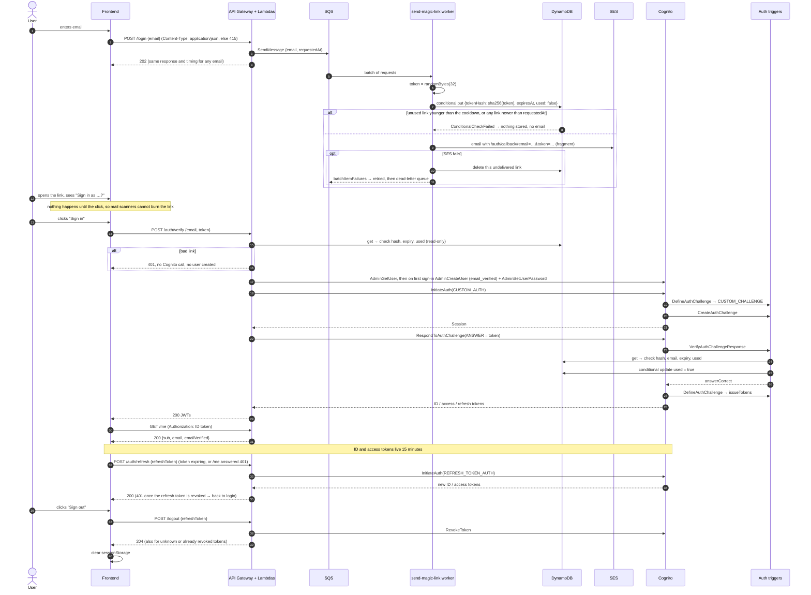

# Magic Links with Amazon Cognito

Passwordless authentication with **magic links** on **Amazon Cognito custom authentication**. The whole stack runs **100% locally** on LocalStack and is provisioned with Terraform.

Enter your email, click the link you receive, and you get Cognito JWTs. No passwords, and no AWS account needed.

> Based on Yan Cui's article [Implementing Magic Links with Amazon Cognito: A Step-by-Step Guide](https://theburningmonk.com/2023/03/implementing-magic-links-with-amazon-cognito-a-step-by-step-guide/), re-architected around DynamoDB and hashed single-use tokens (see [How this differs from the article](#how-this-differs-from-the-article)).


---

## Features

**Security**

- ✅ Passwordless authentication
- ✅ Cryptographically secure tokens (256-bit, `crypto.randomBytes`)
- ✅ SHA-256 token hashing: no plaintext tokens are stored
- ✅ Link expiration (10 minutes, plus DynamoDB TTL cleanup)
- ✅ Single-use tokens, enforced by an atomic conditional write
- ✅ Token invalidation: a new link (issued once the cooldown allows it) revokes the previous one
- ✅ Email ownership verification: the token is bound to the Cognito user's email, which users cannot change themselves
- ✅ Constant-time hash comparison
- ✅ No user enumeration: `/login` gives the same response, in the same time, for every email, and Cognito answers unknown users with a decoy challenge
- ✅ Encryption at rest with a customer-managed KMS key
- ✅ Least-privilege IAM, one role per Lambda
- ✅ Per-email cooldown (one link per minute), AWS WAF per-IP rate limits and per-route throttling against email bombing
- ✅ Scanner-safe links: parameters in the URL fragment, and nothing is verified until the user clicks "Sign in as …"
- ✅ Cognito users are created only once someone proves they own the address
- ✅ Asynchronous, retried email delivery (SQS + dead-letter queue): an SES outage never loses a link or locks a user out
- ✅ Real sign-out: `POST /logout` revokes the Cognito refresh token
- ✅ Short-lived tokens (15 minutes) renewed silently through `POST /auth/refresh`
- ✅ AWS throttling surfaces as `429 Retry-After`, never as a generic `500`

**Engineering**

- ✅ Cognito `CUSTOM_AUTH` with Define / Create / Verify triggers
- ✅ Infrastructure as Code (Terraform)
- ✅ Local AWS emulation (LocalStack + Docker Compose)
- ✅ Unit tests with 100% coverage (backend + frontend), integration tests, a Postman API collection and Playwright browser E2E tests
- ✅ Observability: explicit CloudWatch log groups with retention, JSON access logs, X-Ray tracing
- ✅ Lint + format with Biome, Terraform static analysis with tflint and Checkov
- ✅ CI on GitHub Actions: audit, lint, typecheck, tests, build, Terraform checks, LocalStack E2E
- ✅ React + Vite frontend

---

## Architecture


- **A. Request a link.** `POST /login` only queues the email (and when it was asked) in SQS and answers `202`. The `send-magic-link` worker applies the cooldown, stores `sha256(token)` in DynamoDB and emails the link with SES.
- **B. Exchange the link.** The callback page asks "Sign in as …?", then posts `{email, token}` to `/auth/verify`. The Lambda checks the link in DynamoDB (read-only), creates the Cognito user on the first sign-in, and runs Cognito `CUSTOM_AUTH`; the `VerifyAuthChallengeResponse` trigger consumes the token atomically.
- **C. Use the JWT.** `GET /me` is protected by the API Gateway Cognito authorizer, and the Lambda verifies the ID token again (signature against the pool's JWKS, issuer, audience, expiry, `token_use`) with `aws-jwt-verify`, so every claim it returns is proven.
- **D. Session.** ID and access tokens live 15 minutes. The frontend renews them silently with `POST /auth/refresh` shortly before they expire, or once when an API call answers `401`. `POST /logout` revokes the refresh token in Cognito, so the session can't be renewed any more.
- **AWS WAF** sits in front of the API with per-IP rate limits (stricter on `/login`) and the AWS Common and Known Bad Inputs managed rule groups.

More diagrams (Mermaid sources in [`docs/mmd`](docs/mmd), rendered to [`docs/img`](docs/img)):

| Diagram | What it shows |
|---|---|
| [Components](docs/img/architecture.svg) | Lambdas, Cognito triggers and the AWS services they use |
| [Sequence](docs/img/magic-link-sequence.svg) | The full flow: request → email → JWT → `/me` → silent renewal → sign-out |
| [DefineAuthChallenge](docs/img/define-auth-challenge.svg) | The custom-auth state machine (retries, failure, token issue) |
| [Token rules](docs/img/verify-token-rules.svg) | Every check the verify trigger makes, in order |
| [Deployment](docs/img/deployment.svg) | Docker Compose, LocalStack, Terraform and the test runners |

### The flow



---

## How this differs from the article

The article stores the magic-link token in a Cognito **custom attribute**. As the author points out, that caps throughput at the `AdminUpdateUserAttributes` rate limit. It also makes the link carry KMS-encrypted state.

This project keeps the same Cognito trigger mechanics and changes where the state lives:

| | Article | This project |
|---|---|---|
| Token storage | Cognito custom attribute | DynamoDB, keyed by `EMAIL#<email>` |
| What is stored | Token (KMS-encrypted payload) | **SHA-256 hash only** |
| Throughput | Bounded by Cognito admin API limits | DynamoDB on-demand |
| Single use | Attribute overwritten after login | Atomic `ConditionExpression` (race-safe) |
| Cleanup | Manual | DynamoDB TTL on `expiresAt` |
| Cognito `Session` problem | Session must outlive the email | Auth starts **when the link is opened**, so no long-lived session |
| KMS | Encrypts the token payload | Customer-managed key for the table |

**Why SHA-256 and not bcrypt?** Password hashes are slow on purpose, because passwords have little entropy. These tokens are 256 bits from a CSPRNG, so brute-forcing a SHA-256 preimage is already infeasible. A fast hash is the right tool here.

---

## Tech stack

| Layer | Technology |
|---|---|
| Language | TypeScript (strict), Node.js 22 |
| Auth | Amazon Cognito User Pools, custom auth triggers |
| Compute | AWS Lambda (bundled with esbuild) |
| API | Amazon API Gateway (REST) with a Cognito authorizer, behind AWS WAF |
| Data | Amazon DynamoDB (TTL, conditional writes) |
| Email | Amazon SES, fed by an Amazon SQS queue (with a dead-letter queue) |
| Encryption | AWS KMS (customer-managed key) |
| IaC | Terraform |
| Local cloud | LocalStack in Docker Compose |
| Validation | Zod |
| Tests | Vitest, aws-sdk-client-mock, Testing Library + happy-dom, Postman/newman, Playwright |
| Lint / format | Biome |
| Observability | CloudWatch Logs, X-Ray |
| Frontend | React 19 + Vite |
| CI | GitHub Actions |

---

## Project structure

```
.
├── apps/
│   ├── api/src/
│   │   ├── handlers/
│   │   │   ├── login.ts                 # POST /login → queue the request
│   │   │   ├── send-magic-link.ts       # SQS worker: cooldown, store hash, send email
│   │   │   ├── auth-callback.ts         # POST /auth/verify → JWTs
│   │   │   ├── me.ts                    # GET /me (Cognito authorizer)
│   │   │   ├── refresh.ts               # POST /auth/refresh → new 15-minute tokens
│   │   │   └── logout.ts                # POST /logout → RevokeToken
│   │   ├── services/
│   │   │   ├── token.service.ts         # generate / hash / compare tokens
│   │   │   ├── magic-link.service.ts    # issue + check + consume links (core rules)
│   │   │   ├── login-queue.service.ts   # SQS producer for POST /login
│   │   │   ├── email.service.ts         # SES email + templates
│   │   │   └── cognito.service.ts       # user provisioning, CUSTOM_AUTH, refresh, revoke
│   │   ├── repositories/
│   │   │   └── magic-link.repository.ts # DynamoDB access
│   │   └── lib/                         # env, http, validation, logging, AWS clients
│   ├── cognito/triggers/
│   │   ├── define-auth-challenge.ts
│   │   ├── create-auth-challenge.ts
│   │   └── verify-auth-challenge.ts
│   └── frontend/                        # React + Vite (auth.ts: silent token renewal)
├── infrastructure/terraform/            # Cognito, Lambda, API GW, WAF, DynamoDB, SES, SQS, KMS, IAM, logs
├── api/                                 # Postman collection (API contract tests)
├── arch/architecture.svg                # high-level AWS architecture
├── docs/{mmd,img}/                      # Mermaid sources and rendered diagrams
├── tests/
│   ├── unit/                            # backend (frontend tests live next to the components)
│   ├── integration/                     # runs against LocalStack
│   └── e2e/                             # Playwright, real browser
├── scripts/
│   ├── build.mjs                        # esbuild → dist/<function>/index.js
│   ├── emails.mjs                       # read emails captured by LocalStack SES
│   └── demo.sh                          # full flow from the terminal
├── biome.json                           # lint + format
├── docker-compose.yml
└── Makefile
```

---

## Getting started

### Prerequisites

- Docker
- Node.js 22+
- Terraform 1.6+
- `jq` (for the `make login` / `make verify` / `make demo` helpers)
- Optional: [tflint](https://github.com/terraform-linters/tflint) and [Checkov](https://www.checkov.io) for `make tf-scan`
- **A LocalStack auth token on a plan that includes Cognito.** Since LocalStack 2026.03 every image needs a token to start, and Cognito User Pools are not part of the free **Hobby** plan ([plan comparison](https://docs.localstack.cloud/aws/licensing/)). Get a token at [app.localstack.cloud](https://app.localstack.cloud/workspace/auth-token). Without one you can still run lint, typecheck, unit tests, builds and the Terraform checks.

### 1. Install and configure

```bash
npm install
cp .env.example .env    # then set LOCALSTACK_AUTH_TOKEN
```

### 2. Start LocalStack

```bash
make up
```

### 3. Deploy the infrastructure

```bash
make infra
```

This bundles the Lambdas with esbuild, runs `terraform apply` against LocalStack, and writes the API URL to `apps/frontend/.env.local`.

```
✓ KMS key            ✓ DynamoDB table (TTL + CMK encryption)
✓ SES identity       ✓ IAM roles (one per Lambda)
✓ 9 Lambdas          ✓ Cognito user pool + client + triggers
✓ SQS queue + DLQ    ✓ API Gateway + Cognito authorizer + per-route throttling
✓ AWS WAF (per-IP rate limits, managed rules)
✓ CloudWatch log groups (14-day retention) + JSON access logs
```

### 4. Try it

**From the terminal:**

```bash
make demo EMAIL=luiz@example.com
```

```
▶ 1. POST /login  (luiz@example.com)
▶ 2. Magic link captured by LocalStack SES (sent asynchronously by the SQS worker)
▶ 3. POST /auth/verify  (Cognito CUSTOM_AUTH)
▶ 4. GET /me  (JWT validated by the API Gateway Cognito authorizer)
▶ 5. Reusing the same link must fail
HTTP 401
```

**Step by step:**

```bash
make login  EMAIL=luiz@example.com   # request a link
make emails                          # read the captured email
make verify EMAIL=luiz@example.com   # exchange the latest link for JWTs
```

**In the browser:**

```bash
make frontend        # http://localhost:5173
```

Enter an email, run `make link EMAIL=<that email>`, open the printed URL and click **Sign in**.

### Cleaning up

```bash
make down            # stops LocalStack and deletes its data + Terraform state
```

Run `make help` to see every target.

### Environment variables

**`.env`** (read by Docker Compose, copy from [`.env.example`](.env.example)):

| Variable | Required | Description |
|---|---|---|
| `LOCALSTACK_AUTH_TOKEN` | yes | LocalStack license token (Cognito needs it) |
| `LOCALSTACK_IMAGE` | no | Override the pinned LocalStack image |
| `LOCALSTACK_DEBUG` | no | `1` for verbose LocalStack logs |
| `LAMBDA_CONCURRENCY` | no | Max concurrent Lambda containers in LocalStack (default `20`), like an account quota |

**Lambdas** (set by Terraform in [`lambda.tf`](infrastructure/terraform/lambda.tf), never by hand):

| Variable | Used by | Description |
|---|---|---|
| `LOGIN_QUEUE_URL` | login | SQS queue the requests go to |
| `USER_POOL_ID`, `USER_POOL_CLIENT_ID` | auth-callback, refresh, logout | Cognito pool and public client |
| `MAGIC_LINKS_TABLE` | send-magic-link, auth-callback, verify trigger | DynamoDB table name |
| `SES_FROM_ADDRESS` | send-magic-link | Sender address |
| `MAGIC_LINK_CALLBACK_URL` | send-magic-link | Frontend route the link points to |
| `MAGIC_LINK_TTL_SECONDS` | send-magic-link | Link lifetime (default `600`) |
| `MAGIC_LINK_COOLDOWN_SECONDS` | send-magic-link | Minimum time between two links for one email (default `60`) |
| `CORS_ALLOWED_ORIGIN` | API Lambdas | Allowed origin |

Missing required variables fail the request with a `500` and a clear log line, instead of reaching AWS with `undefined`. There are no secrets: tokens are generated per request and only their hash is stored.

**Frontend:** `make infra` writes `VITE_API_PROXY_TARGET` (the API Gateway URL) to `apps/frontend/.env.local`; the Vite dev server proxies `/api` to it.

**Terraform variables** ([`variables.tf`](infrastructure/terraform/variables.tf)) cover names, URLs, the token lifetime (`token_validity_minutes`, default 15), the link TTL and cooldown (`magic_link_cooldown_seconds`, default 60), log retention (`log_retention_days`, default 14), API throttling per route (`api_throttle_rate_limit` / `api_throttle_burst_limit`, default 100 rps / 200 burst; `POST /login` has its own `login_throttle_rate_limit` / `login_throttle_burst_limit`, 20 / 40, so a flood of link requests cannot block sign-in for users who already hold a link or a session), the worker's concurrency (`send_magic_link_max_concurrency`, default 5) and the WAF (`waf_login_rate_limit` 10 and `waf_api_rate_limit` 300 requests per IP per `waf_rate_window_seconds` 300).

---

## API

| Method | Path | Auth | Description |
|---|---|---|---|
| `POST` | `/login` | none | Queues a magic link. Always returns `202` for a valid email. |
| `POST` | `/auth/verify` | none | Exchanges `{email, token}` for Cognito JWTs. |
| `GET` | `/me` | Cognito ID token | Returns the verified claims. |
| `POST` | `/auth/refresh` | none (the refresh token is the proof) | Exchanges `{refreshToken}` for new ID and access tokens (`200`), or `401` once it is revoked or expired. The refresh token itself is not rotated. |
| `POST` | `/logout` | none (the refresh token is the proof) | Revokes `{refreshToken}`. Always `204`, also for unknown or already revoked tokens. |

Every route can answer `429` with `Retry-After` when WAF or an AWS dependency throttles the request, `400` with `{message, errors[]}` for invalid input, and `415` when the body is not sent as `Content-Type: application/json`.

```bash
API=$(terraform -chdir=infrastructure/terraform output -raw api_url)

curl -X POST "$API/login" -H 'Content-Type: application/json' \
  -d '{"email":"luiz@example.com"}'
# 202 {"message":"If the email address is valid, a magic link is on its way."}

curl -X POST "$API/auth/verify" -H 'Content-Type: application/json' \
  -d '{"email":"luiz@example.com","token":"<64 hex chars>"}'
# 200 {"idToken":"eyJ…","accessToken":"eyJ…","refreshToken":"…","expiresIn":900,"tokenType":"Bearer"}
# 401 {"message":"Invalid or expired magic link"}

curl "$API/me" -H "Authorization: <idToken>"
# 200 {"sub":"…","email":"luiz@example.com","emailVerified":true,"authTime":"…","expiresAt":"…"}

curl -X POST "$API/auth/refresh" -H 'Content-Type: application/json' \
  -d '{"refreshToken":"<refreshToken>"}'
# 200 {"idToken":"eyJ…","accessToken":"eyJ…","expiresIn":900,"tokenType":"Bearer"}
# 401 {"message":"Session expired or revoked"}

curl -X POST "$API/logout" -H 'Content-Type: application/json' \
  -d '{"refreshToken":"<refreshToken>"}'
# 204
```

**Postman collection.** [`api/magic-links.postman_collection.json`](api/magic-links.postman_collection.json) covers every endpoint, happy and sad paths: sign-in (it reads the magic link from LocalStack's SES mailbox), `/me`, token renewal and sign-out, plus `400` validation errors, `415` for a body not declared as JSON, `401` for wrong, reused, forged or revoked tokens, `403` for wrong methods and the cooldown. Import it into Postman and set `apiUrl` (`terraform output -raw api_url`) and `clientId` (`terraform output -raw user_pool_client_id`), or run it headless with `npm run test:api`.

### Data model

A single DynamoDB item per email. A new link replaces the old one, unless the old one is unused and younger than the cooldown (then nothing is written). A link whose email could not be sent is deleted again, so the retry is not blocked by the cooldown. A request that reaches the worker late (retry, duplicate delivery, backed-up queue) never replaces a link created after the user asked.

| Attribute | Example | Notes |
|---|---|---|
| `pk` | `EMAIL#luiz@example.com` | Partition key |
| `email` | `luiz@example.com` | Normalized (trimmed, lower-case) |
| `tokenHash` | `9f86d0…` | `SHA256(token)`, hex |
| `createdAt` | `1767268800` | Epoch seconds |
| `expiresAt` | `1767269400` | Epoch seconds; also the TTL attribute |
| `used` | `false` | Flipped atomically on first use |
| `usedAt` | `1767268900` | Set on consumption |

---

## Testing

| Command | What it runs | Needs |
|---|---|---|
| `npm run lint` | Biome lint + format check | — |
| `npm run typecheck` | `tsc --noEmit` for backend and frontend | — |
| `npm test` / `npm run test:coverage` | Unit tests, backend + frontend (coverage must stay at 100%) | — |
| `npm run build` | esbuild bundles in `dist/` | — |
| `npm run build -w apps/frontend` | Frontend production build | — |
| `npm run test:integration` | Integration tests against the deployed stack | `make up && make infra` |
| `npm run test:api` | Postman collection via newman | `make up && make infra` |
| `npm run test:e2e` | Browser E2E tests with Playwright (starts Vite itself) | `make up && make infra`, `npx playwright install chromium` |
| `make test-aws` | Smoke tests for what LocalStack does not enforce, against a real AWS deployment | `make aws-infra` (see [Deploying to real AWS](#deploying-to-real-aws)) |
| `make demo` | Terminal smoke test of the whole flow | `make up && make infra` |
| `make check` | lint + typecheck + unit tests + `terraform fmt -check` / `validate` | Terraform |
| `make tf-scan` | tflint + Checkov | tflint, Checkov |

Every layer covers both the happy path and the failure cases:

| Layer | Happy path | Sad path |
|---|---|---|
| **Unit** (Vitest, 214 tests, 100% statements/branches/functions/lines) | token primitives, link issue/check/consume, Cognito flow, triggers, handlers, SQS worker, refresh, sign-out, silent renewal (before expiry, after a 401, shared between concurrent callers), React pages, router, session | expiry boundary, reuse, races, cooldown, wrong email, malformed input, `415` for non-JSON bodies, SES failure → link dropped and message retried, malformed queue messages, unknown users get a decoy challenge, AWS throttling → 429, other AWS failures → 500 without leaking internals, stuck-user repair, incomplete Cognito responses, revoked/unknown refresh tokens, a 401 that persists after renewal, sign-out when revocation fails, late responses after unmount |
| **Integration** (Vitest against LocalStack, 43 tests) | login → email → JWT → `/me`, 15-minute tokens, refresh → new ID token works on `/me`, link in the URL fragment, user created `CONFIRMED` only on first sign-in, `email_verified`, stuck user repaired, only the hash stored, case-insensitive email, returning user, sign-out revokes the refresh token | reuse, 5 parallel clicks → exactly one 200, wrong token doesn't burn the real one, cross-account token, unknown email, expiry, rotation, email bombing → one email, no enumeration, a bad link creates no user, 400s, `415` for `text/plain` (no email sent), app client cannot write `email`, challenge does not echo the email, `/me` without/forged/tampered/access token, no renewal after sign-out, forged refresh token, invalid sign-out/refresh bodies, 30-request burst absorbed, unknown routes |
| **API collection** (Postman, 32 requests / 60 assertions) | 202, 200 with 15-minute JWTs, `/me` 200, `/auth/refresh` 200 and the renewed token on `/me`, `/logout` 204 and the refresh token then rejected by Cognito and by the API | 415 (`text/plain` body), 400 (invalid JSON, missing/invalid/long email, `null`, array, bad token, missing refresh token), 401 (wrong token, unknown email, reuse, no/forged/access token, forged or revoked refresh token), 403 (wrong method), cooldown, repeated sign-out |
| **E2E** (Playwright, 11 tests) | sign in from the UI with the "Sign in as …" confirmation, profile, expired session renewed silently, sign out (refresh token verified revoked in Cognito), token gone from URL and history, `no-referrer` | session revoked from another device → back to login, a scanner opening the link does not use it, link opened twice, tampered token, incomplete link, invalid email blocked by the browser |

Emails are sent asynchronously, so tests that assert "no extra email" first wait until the login queue is drained (nothing waiting or in flight): SQS deletes a message only once the worker finished it, so a slow worker makes the test wait (or fail on timeout), never pass without having checked anything.

**Unit tests** need no Docker. AWS calls are mocked with `aws-sdk-client-mock`; the React components run in `happy-dom` with Testing Library.

When no stack is deployed, the integration suite is skipped, so `npm run test:integration` never fails spuriously. In CI it runs only when a `LOCALSTACK_AUTH_TOKEN` repository secret is configured.

`npm run test:api` downloads a pinned newman with `npx` instead of adding it as a dependency, because newman's dependency tree has open advisories.

---

## CI

[`.github/workflows/ci.yml`](.github/workflows/ci.yml) runs on every push to `main` and every pull request:

| Job | Steps |
|---|---|
| **quality** | `npm ci` → `npm audit --audit-level=high` → lint → typecheck → unit tests with coverage → Lambda build → frontend build |
| **terraform** | `fmt -check` → `init -backend=false` → `validate` → tflint → Checkov (skips are justified in [`.checkov.yaml`](infrastructure/terraform/.checkov.yaml)) |
| **integration** | Docker Compose LocalStack → `make infra` (Terraform apply) → integration tests → Postman collection → Playwright browser E2E → `make demo` |

The integration job needs a `LOCALSTACK_AUTH_TOKEN` repository secret. Without it (for example on forks) the job is skipped rather than failed, since there is nothing to run against. There is no `terraform plan`/`apply` against a real AWS account because the project only targets LocalStack.

---

## Security considerations

**What is protected**

- **Leaked database.** Only SHA-256 hashes are stored, and they can't be reversed into working links. The table is also encrypted with a KMS CMK.
- **Forged tokens.** Besides the API Gateway authorizer, `/me` verifies the ID token itself (RS256 signature against the pool's JWKS, issuer, audience, expiry, `token_use = id`). A JWKS outage answers `500`, not `401`, so a valid session is never dropped. The JWKS is fetched over https; plain http is accepted only for local hosts (LocalStack).
- **Replay.** `used` is flipped with a `ConditionExpression` that re-checks the hash, `used = false` and `expiresAt > now` in the same write. If two requests race, only one can win.
- **Stale links.** A new link overwrites the item, so older links stop working immediately.
- **Cross-account use.** The verify trigger reads the email from **Cognito's user attributes**, not from the client, so a token only works for the account it was issued to.
- **Email takeover.** The app client has no write access to `email` (`write_attributes`), so a signed-in user cannot call `UpdateUserAttributes` with their access token to claim someone else's address. Emails are created `email_verified = true`, which is sound because tokens are only issued to whoever clicked a link sent to that address. Identify users by `sub`.
- **Timing attacks.** Hashes are compared with `crypto.timingSafeEqual`.
- **Enumeration.** `/login` answers `202` with the same body for every valid email, and in the same time (it only queues the request). The client ID is public, so Cognito can be called directly: with `prevent_user_existence_errors`, Cognito runs the triggers for unknown users too, and `DefineAuthChallenge` answers them with the same decoy challenge a real user gets (they can never get tokens); `CreateAuthChallenge` publishes no parameters, so the challenge never echoes an email.
- **Log hygiene.** Tokens and JWTs are never logged, and emails are masked (`l***@example.com`).
- **URL leakage.** Email and token travel in the URL fragment (`#…`), which browsers never send to a server, so they stay out of web server, CDN and proxy logs. The callback page removes them from the address bar and history as soon as it opens, and `<meta name="referrer" content="no-referrer">` keeps them out of `Referer` headers.
- **Link scanners and link injection.** Nothing is verified when the link is opened: the page asks "Sign in as …?" and waits for a click. Mail scanners that open (and even render) every link cannot burn it, and a link someone else sent cannot silently sign you into their account.
- **Clickjacking.** The frontend is served with `Content-Security-Policy: frame-ancestors 'none'` and `X-Frame-Options: DENY`, so no page can frame the "Sign in" button to trick a visitor into signing into someone else's account. The Vite server sends them locally; whatever hosts the production build must send them too.
- **Cross-site requests.** Bodies must be sent as `Content-Type: application/json` (`415` otherwise). A foreign page can only send that after a CORS preflight, which it fails, so it cannot make its visitors' browsers request links on its behalf.
- **Email bombing.** A second link for the same email within 60 seconds is neither stored nor sent (atomic conditional write, so parallel requests can't bypass it). The response is the same `202`, so the cooldown reveals nothing.
- **Mass mailing from one client.** AWS WAF allows 10 `POST /login` per IP per 5 minutes (300 requests overall) and answers `429 Retry-After` beyond that. The rule decodes and normalises the path first, so `/login/`, `//login` or percent-encoded spellings (which API Gateway routes to the same Lambda) are counted too. `POST /login` also has its own throttling budget, so flooding it cannot starve the other routes.
- **Email delivery failures.** If SES fails, the undelivered link is deleted and SQS retries the message (then parks it in a dead-letter queue), so an outage never leaves a user stuck behind the cooldown with no email.
- **First sign-in on real Cognito.** The Cognito user is created by `/auth/verify`, only after the link was checked, so addresses nobody verifies never become users. `AdminCreateUser` leaves users in `FORCE_CHANGE_PASSWORD`, and Cognito refuses to sign them in, so a random permanent password nobody knows is set (the client only allows `CUSTOM_AUTH`), and new users are `CONFIRMED`. If that step ever fails, the next sign-in finds the user still in `FORCE_CHANGE_PASSWORD` and repairs it. LocalStack does not enforce this rule, so integration tests check the status directly.
- **Sign-out.** `POST /logout` revokes the refresh token, and with it the access tokens minted from it, so a stolen session can't be extended.
- **Throttling.** When an AWS dependency is still throttling after the SDK's retries, clients get `429 Retry-After: 5`, not a `500`.

**Known limitations / next steps**

- **The ID token outlives sign-out by at most 15 minutes.** API Gateway validates the JWT signature and expiry without asking Cognito about revocation, so an ID token keeps working on `/me` until it expires. Tokens are short-lived for exactly this reason, and an integration test documents the behaviour. Closing the window completely would need a Cognito call on every request (`GetUser` with the access token), which adds latency and uses Cognito quota on every call.
- **No refresh-token rotation.** The same refresh token (30 days) is reused for every renewal. Cognito can rotate it on each use, which limits the damage of a leaked refresh token; it is not enabled here.
- **Some protections are only enforced on AWS.** LocalStack does not enforce the app client's `write_attributes`, the WAF or the API throttling, does not run the auth triggers for unknown users, and does not check JWT signatures in the Cognito authorizer (the `/me` Lambda does, so that one is tested locally too). Integration tests check the configuration, unit tests the trigger logic, and `make test-aws` checks the real behaviour on an AWS deployment: email change refused, decoy challenge for unknown users, forged tokens refused by the authorizer, and the `/login` WAF limit, including `/login/` and `//login`. API throttling is not load-tested.
- **The app client is public.** Anyone can call `InitiateAuth` / `RespondToAuthChallenge` directly, outside the API WAF (they still need a valid link to get tokens). A confidential client (a secret, `SECRET_HASH` computed by the Lambdas) would close that path; a per-IP WAF on the user pool would not, since the Lambdas call Cognito from a few shared AWS addresses.
- **Rate limits are only enforced on AWS.** LocalStack provisions the WAF and the API throttling but doesn't enforce them, so their `429`s are covered by Terraform validation and unit tests, not by an end-to-end test. What LocalStack does enforce is the Lambda concurrency cap from `docker-compose.yml`, and a 30-request burst test keeps it honest.
- **Anonymous IPs are allowed.** The `AWSManagedRulesAnonymousIpList` group is off on purpose: it would block legitimate users on VPNs.
- **Implicit sign-up.** Anyone who clicks a link sent to their address gets a Cognito user. Put a separate sign-up flow or an allow-list in front of this if that's not acceptable.
- **Token storage in the browser.** The demo keeps JWTs in `sessionStorage`. A production app should hold them in memory or in `httpOnly` cookies set by a backend-for-frontend.
- **Same-device only.** A link can't be opened on one device to sign in on another. Cross-device sign-in would need a polling or WebSocket handshake.

---

## Terraform

```bash
make infra                                            # build + init + apply against LocalStack
terraform -chdir=infrastructure/terraform plan        # preview changes (after make build)
make destroy                                          # destroy the resources
make outputs                                          # api_url, user_pool_id, …
```

**State.** State is local (`infrastructure/terraform/terraform.tfstate`, git-ignored) because the stack only lives inside a disposable LocalStack container; `make down` deletes both. No bootstrap is needed.

**Providers** are pinned in `main.tf` (`aws ~> 5.0`, `archive ~> 2.4`) and locked in `.terraform.lock.hcl`.

## Deploying to real AWS

The code has no LocalStack-specific logic (the SDK picks up `AWS_ENDPOINT_URL` inside LocalStack). Terraform takes `target = "localstack"` (default) or `target = "aws"`; with `aws` it uses your default credential chain and real endpoints, and derives the Cognito issuer for the `/me` token check. The real deployment lives in its own Terraform workspace (`aws`), so it never mixes with the disposable LocalStack state.

```bash
make aws-infra        # terraform apply -var target=aws in workspace "aws" (AWS_TF_VARS="-var ..." to pass more)
make test-aws         # smoke tests for what LocalStack does not enforce
make aws-destroy      # tear it down
```

**It costs money and changes the account**: WAF web ACL and rules, a KMS key, API Gateway, Lambda, SQS, DynamoDB and Cognito are billed (small amounts for a short test, but WAF and KMS bill monthly until destroyed), and `aws_api_gateway_account` sets the account-wide CloudWatch role for API Gateway. `make test-aws` blocks `POST /login` from your IP for the WAF window (5 minutes), creates Cognito users named `smoke-…@example.com` and deletes them afterwards, and sends WAF-test emails only to the SES mailbox simulator.

For production, on top of that:

1. Bootstrap remote state once: an S3 bucket with versioning and encryption, then add a `backend "s3"` block with `use_lockfile = true` (Terraform ≥ 1.10), or a DynamoDB lock table for older versions.
2. Set `ses_from_address` to an address or domain you own, verify it (DKIM/SPF/DMARC), and move SES out of the sandbox.
3. Point `magic_link_callback_url` / `frontend_origin` at your deployed frontend, and serve it with the same security headers as the Vite server (`frame-ancestors 'none'`, `X-Frame-Options: DENY`).
4. Revisit the production items skipped in [`.checkov.yaml`](infrastructure/terraform/.checkov.yaml) and the ones this local project leaves out: CloudWatch alarms with a notification target (5xx, WAF blocks, dead-letter queue depth, SES bounces), longer log retention, Lambda aliases for gradual rollout, refresh-token rotation.

---

## Architectural decisions

- **DynamoDB instead of a Cognito custom attribute** for token state. See [How this differs from the article](#how-this-differs-from-the-article).
- **One Lambda per route and per trigger.** Each has its own IAM role with only the permissions it needs; bundles are tiny because esbuild tree-shakes per entry point.
- **`/auth/refresh` and `/logout` have no authorizer.** Holding the refresh token is the proof of ownership, and an expired ID token must never prevent someone from renewing the session or signing out.
- **A queue between `/login` and the email.** `POST /login` does no per-email work, so its response time reveals nothing, and SES failures are retried by SQS with a dead-letter queue instead of failing the request. Everything else stays synchronous (API Gateway or Cognito), with no Step Functions.
- **Plain classes, no DI framework.** Handlers wire their dependencies directly. `MagicLinkService` holds the rules and `evaluateMagicLink` is a pure function, so the core logic is tested without AWS mocks.
- **Small in-house JSON logger** instead of Powertools: three functions with masked emails are all the logging these Lambdas need.
- **Biome** for lint and format. The project uses TypeScript 7 (native compiler), which `typescript-eslint` does not support yet.

---

## Credits

- [Yan Cui (theburningmonk)](https://theburningmonk.com/2023/03/implementing-magic-links-with-amazon-cognito-a-step-by-step-guide/), for the original article and the Cognito custom-auth approach.
- [LocalStack](https://localstack.cloud), for making it possible to run all of this on a laptop.

## License

[MIT](LICENSE)
