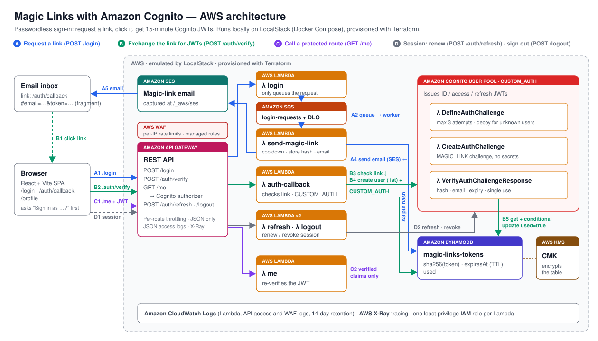
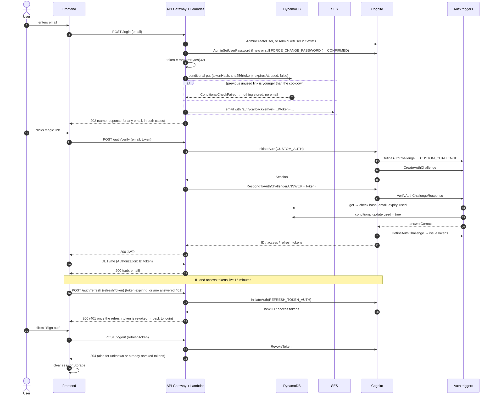

[← README](../README.md) · [Architecture](architecture.md) · [API](api.md) · [Security](security.md) · [Testing](testing.md) · [Deployment](deployment.md)

# Architecture



- **A. Request a link.** `POST /login` queues `{email, requestedAt}` in SQS and answers `202`. The `send-magic-link` worker applies the cooldown, stores `sha256(token)` in DynamoDB and emails the link with SES.
- **B. Exchange the link.** The callback page asks "Sign in as …?", then posts `{email, token}` to `/auth/verify`. The Lambda checks the link (read-only), creates the Cognito user on first sign-in and runs Cognito `CUSTOM_AUTH`; the `VerifyAuthChallengeResponse` trigger consumes the token atomically.
- **C. Use the JWT.** `GET /me` is protected by the Cognito authorizer, and the Lambda verifies the ID token again with `aws-jwt-verify` (signature, issuer, audience, expiry, `token_use`).
- **D. Session.** ID and access tokens live 15 minutes. The frontend renews them with `POST /auth/refresh` before expiry, or once after a `401`. `POST /logout` revokes the refresh token.
- **AWS WAF** applies per-IP rate limits (stricter on `/login`) and the AWS Common and Known Bad Inputs rule groups.

| Diagram | Shows |
|---|---|
| [Components](img/architecture.svg) | Lambdas, triggers, AWS services, logs and alarms |
| [Sequence](img/magic-link-sequence.svg) | Request → email → JWT → `/me` → renewal → sign-out |
| [DefineAuthChallenge](img/define-auth-challenge.svg) | The custom-auth state machine |
| [Token rules](img/verify-token-rules.svg) | The checks of the verify trigger, in order |
| [Deployment](img/deployment.svg) | Docker Compose, LocalStack, Terraform, test runners |

Sources are in [`mmd/`](mmd); render one with `npx @mermaid-js/mermaid-cli@11.4.2 -b white -i docs/mmd/<name>.mmd -o docs/img/<name>.svg`. [`aws-architecture.svg`](img/aws-architecture.svg) is drawn by hand.

## The flow



## Comparison with the article

The article keeps the token in a Cognito custom attribute. This project uses the same trigger mechanics with the state in DynamoDB:

| | Article | This project |
|---|---|---|
| Token storage | Cognito custom attribute | DynamoDB item keyed by `EMAIL#<email>` |
| Stored value | KMS-encrypted token | SHA-256 hash only |
| Throughput | Cognito admin API limits | DynamoDB on-demand |
| Single use | Attribute overwritten after login | Atomic conditional update |
| Cleanup | Manual | DynamoDB TTL (`purgeAt`) |
| Cognito session | Must outlive the email | Starts when the link is used |

Tokens are 256 random bits, so a fast hash (SHA-256) is enough: the preimage cannot be brute-forced.

## Data model

One DynamoDB item per email. A new link replaces the previous one unless that one is unused and inside the cooldown, which doubles with each link issued in a row without one being used. The worker decides in a pure function (`decideIssue`) and writes only if the item is unchanged (optimistic concurrency). An undelivered link is deleted so the retry is not blocked. A late request never replaces a link created after it, except the retry of the request that wrote an undelivered link.

| Attribute | Example | Notes |
|---|---|---|
| `pk` | `EMAIL#luiz@example.com` | Partition key |
| `email` | `luiz@example.com` | Trimmed, lower-case |
| `tokenHash` | `9f86d0…` | `SHA256(token)`, hex |
| `createdAt` | `1767268800` | Epoch seconds |
| `expiresAt` | `1767269400` | Epoch seconds; end of validity |
| `used` | `false` | Set atomically on first use |
| `usedAt` | `1767268900` | Epoch seconds |
| `streak` | `2` | Links in a row without one being used |
| `requestId` | `1f0c…` | SQS message that issued the link |
| `deliveredAt` | `1767268801` | Epoch seconds, once SES accepts the email |
| `purgeAt` | `1767355200` | TTL, a day after the write |

## Decisions

- **DynamoDB for token state**, not a Cognito attribute (see the comparison).
- **One Lambda per route and per trigger**, each with its own least-privilege role and a tree-shaken bundle.
- **No authorizer on `/auth/refresh` and `/logout`**: the refresh token is the proof, and an expired ID token must not block renewal or sign-out.
- **A queue between `/login` and the email**: `/login` does no per-email work, so its timing reveals nothing, and SES failures are retried by SQS. Everything else is synchronous; there are no Step Functions.
- **Plain classes, no DI framework.** Handlers wire their dependencies. Rules live in pure functions (`decideIssue`, `evaluateMagicLink`).
- **In-house JSON logger**, not Powertools. Entries carry the Lambda and API Gateway request IDs and the X-Ray trace ID (also in the API access logs); the worker logs the trace of the `POST /login` behind each message.
- **Alarms to one SNS topic**: Lambda errors, throttles and duration (p99 above 80% of the timeout), API 5xx, a sustained 4xx share, DLQ depth.
- **No Lambda aliases or reserved concurrency.** A deploy is one `terraform apply`; rollback is applying the previous commit. Concurrency is bounded by API throttling, the WAF and the worker's `maximum_concurrency`.
- **Biome** for lint and format, since the project uses TypeScript 7, which `typescript-eslint` does not support.

## Tech stack

| Layer | Technology |
|---|---|
| Language | TypeScript (strict), Node.js 22 |
| Auth | Amazon Cognito User Pools, custom auth triggers |
| Compute | AWS Lambda, bundled with esbuild |
| API | Amazon API Gateway (REST), Cognito authorizer, AWS WAF |
| Data | Amazon DynamoDB (TTL, conditional writes), AWS KMS |
| Email | Amazon SES behind Amazon SQS (with a DLQ) |
| Observability | CloudWatch Logs, CloudWatch alarms → SNS, X-Ray |
| IaC | Terraform |
| Local cloud | LocalStack in Docker Compose |
| Frontend | React 19 + Vite; nginx image for the production build |
| Validation | Zod |
| Tests | Vitest, aws-sdk-client-mock, Testing Library + happy-dom, Postman/newman, Playwright |
| Lint / format | Biome |
| CI | GitHub Actions, Dependabot |

## Project structure

```
.
├── apps/
│   ├── api/src/
│   │   ├── handlers/          # login, send-magic-link (SQS), auth-callback, me, refresh, logout
│   │   ├── services/          # token, magic-link (rules), login-queue, email, cognito
│   │   ├── repositories/      # DynamoDB access
│   │   └── lib/               # env, http, validation, logger, AWS clients, ID token verification
│   ├── cognito/triggers/      # define, create and verify auth challenge
│   └── frontend/              # React app, Dockerfile, nginx config
├── infrastructure/terraform/  # every AWS resource, alarms included
├── api/                       # Postman collection
├── docs/                      # guides; mmd/ diagram sources, img/ renders
├── tests/                     # unit, integration (LocalStack), e2e (Playwright), aws (smoke)
├── scripts/                   # esbuild build, SES mailbox reader, terminal demo
├── docker-compose.yml
└── Makefile
```
